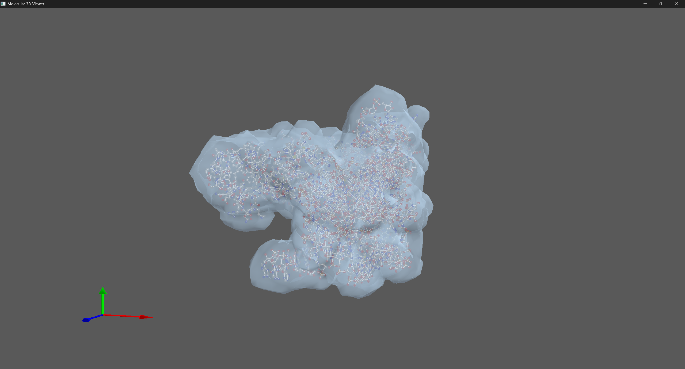

# Molecular 3D Viewer

A 3D molecular visualization tool built with Rust and wgpu. This is a personal learning project to explore wgpu graphics programming and molecular rendering techniques.



## Features

-   **PDB File Support**: Parse and load standard PDB format files
-   **Multiple Rendering Styles**:
    -   Ball and Stick model
    -   Space Filling model
    -   Molecular Surface (transparent)
-   **Interactive Controls**:
    -   Left click + drag: Rotate view
    -   Right click + drag: Pan view
    -   Mouse wheel: Zoom
-   **Element-based Coloring**: Automatic atom coloring by element type
-   **Molecular Type Recognition**: Different colors for proteins, DNA, RNA
-   **Real-time Lighting**: Phong lighting model with ambient and diffuse components
-   **WebAssembly**

## Controls

-   **Mouse**: Left drag to rotate, right drag to pan, scroll to zoom
-   **Keyboard**: Number keys to switch between rendering modes
-   **Esc**: Exit application

## Getting Started

### Prerequisites

-   Rust 1.70+
-   Modern GPU with wgpu support

### Building and Running

```bash
git clone https://github.com/hkhkhove/molecular-3d-viewer.git
cd molecular-3d-viewer

# Build the project
cargo build --release

# Run with default protein
cargo run

# Or modify config.json to load your own PDB files
```

### Configuration

Edit `config.json` to customize:

-   Protein file paths
-   Rendering styles
-   Window settings
-   Camera parameters

## Project Structure

```
src/
├── lib.rs          # Main application logic and rendering
├── main.rs         # Entry point
├── config.rs       # Configuration system
├── pdb_parser.rs   # PDB file parser
├── camera.rs       # Camera controls and transformations
├── geometry.rs     # Molecular geometry generation
└── shader.wgsl     # WGSL shaders
```

## Learning Goals

This project explores:

-   **wgpu Graphics API**: Modern GPU programming with Rust
-   **3D Rendering Pipeline**: Vertex/fragment shaders, depth testing, blending
-   **Molecular Visualization**: Scientific data representation and interaction

## Technology Stack

-   **Rust**: Memory-safe systems programming
-   **wgpu**: Cross-platform GPU API (Vulkan/Metal/DX12/WebGL)
-   **winit**: Cross-platform windowing
-   **cgmath**: 3D mathematics library
-   **mcubes**: Marching cubes for surface generation

## Acknowledgments

Inspired by professional molecular visualization tools like PyMOL and ChimeraX.
